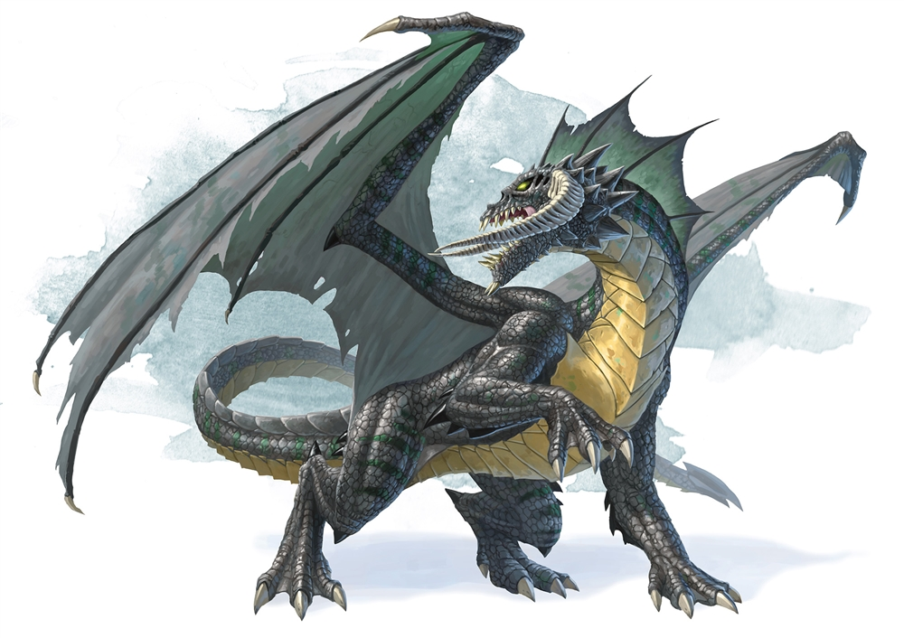

# Metaland Beta v0.1


**Good to know:** This is not the final version


\
**MetaLand is an RPG played from the monsters' perspective, based on the D20 rules.**

It balances casual and strategy, with a complete social system and a focus on strong metaverse immersion. The plot of the game takes place on top of a magical continent. Players can claim their own lands, create monsters, organize their own monster teams to adventure on the map, defeat real enemies, solve random events, collect powerful treasures, and maintain peace and stability on the continent.

**MetaLand also integrates with the Rarity.** Rarity is achieved via an active economy, in which summoners must level, gain feats, learn spells, to be able to craft gear. This allows for rarity driven by market while allowing an ever growing economy. Feats, spells, and summoner gear are omitted as part of further expansions. The uniqueness and value of Rarity lay in its bottom-up ecological construction model, which is different from all other top-down centralized projects. We see the path of Rarity evolving from pure text, to a 2D image, and even to a 3D character that can be used in games, all interacting with the same contracts and persistent NFT characters across formats.

### Origin Story

At first, monsters, who had proved their strength with extreme savagery and cruelty in devouring Barr and Sith, were created by Atlas to destroy Titans. Then the first human-monster war broke out when monsters turned against human for nothing to feed, in which human won and sealed all the monsters into the realm of Void.

But the monsters kept on eating each other and evolving, looking for every opportunities to revenge...
