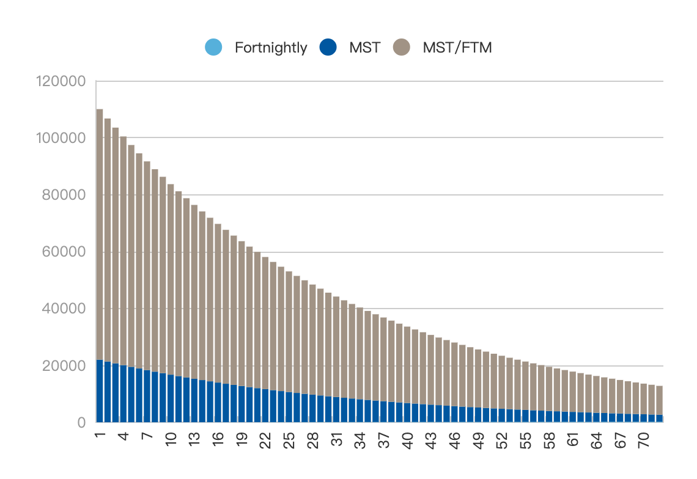

# Liquidity Provider


Coming Soon


Users can generate LPs by pledging single coins or trading pairs to add liquidity to MST. after generating LPs, pledged LPs will be rewarded with MSTs. LPs represent the credentials for liquidity providers to redeem their assets and receive rewards. Also locking in single coin MST for different times also gives access to governance tokens veMST. veMST can be used to increase the percentage of LPs in addition to voting rights to gain excess pledge rewards.

Up to 35,000,000 MSTs would be preserved for liquidity maker as bonus, which are released through a three-year period in accordance with the curve. Of this amount, 20% is allocated to MST single currency pledges and 80% is allocated to MST/FTM trading pairs.

