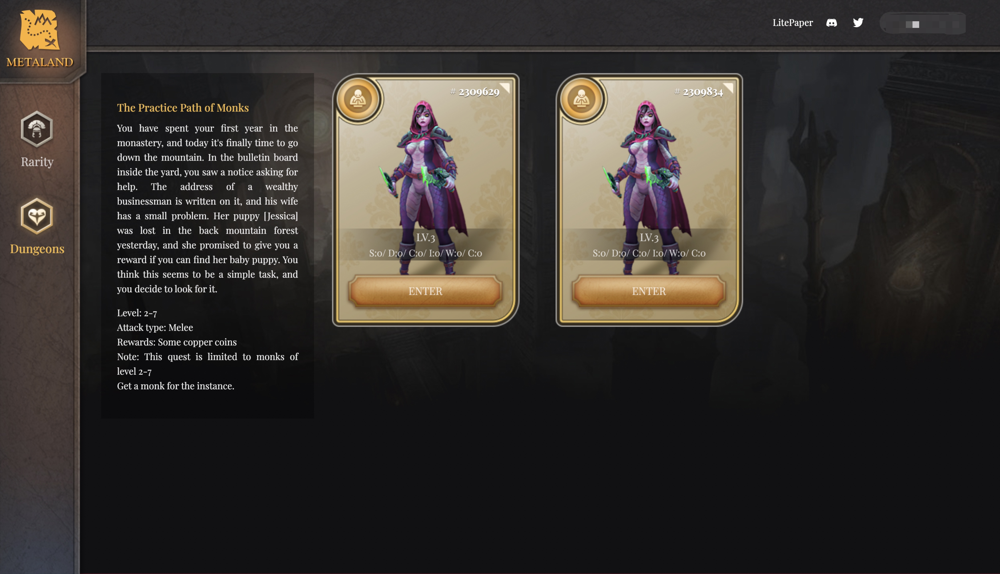

# Dungeons

The first dungeon copy is for monks. Once per day a monk can adventure. When entering a dungeon, a monk will encounter a random monster. If the warrior monk wins the match, he will be rewarded with copper. Otherwise, the monster will take the reward.

_We hope to design one instance of the copy and then have more third party developers available to provide different instances of the copy._ [_Contact us via discord_](https://discord.gg/4re29XnZwt)__

