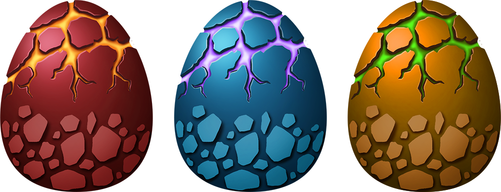

# Eggs

Eggs will be divided into three levels. Namely level1, level2, level3 and level3 is the highest. The level of eggs depends on the value of the eggs, as shown below.

> Eggs Value = Monster Advantage Attribute Value + D6

.png>)

The higher the monster’s advantage attribute value, the higher the probability of producing high-level eggs.

.png>)

### Hatch 

The egg incubation cycle is **7** days.

The level of the egg will affect the rarity of randomly generated monsters, which is the challenge rating CR. Don't take 'high level egg produces high CR monster' for granted. It just increased the probability.

#### Shell Breaking

1. **ready phrase:** some preparation job to determine attributes of the egg (a.k.a Atlas's touch)&#x20;
2. **breaking phrase:** Monster Reborn breaks the shell.

