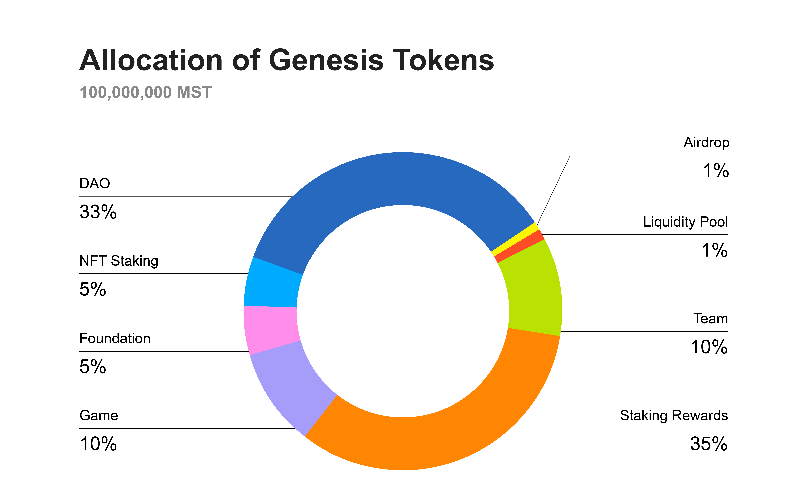

# MST

Token address: [0x152888854378201e173490956085c711f1DeD565](https://ftmscan.com/token/0x152888854378201e173490956085c711f1DeD565)

The Monster Token (**MST**) is a token issued by MonsterDAO, which is the governance token for the gaming ecosystem.

Here are the details of the allocation.

Distribution details

1. Initial liquidity pool, 1%
2. DAO Governance, 33%&#x20;
3. Game, 10%
4. Liquidity Provider, 35%
5. NFT Staking reward, 5%&#x20;
6. Core Team, 10%&#x20;
7. Foundation Reserve, 5%
8. Airdrop, 1%&#x20;

More details can be found in the litepaper, [https://metaland.game/pdf/litepaper.pdf](https://metaland.game/pdf/litepaper.pdf)

